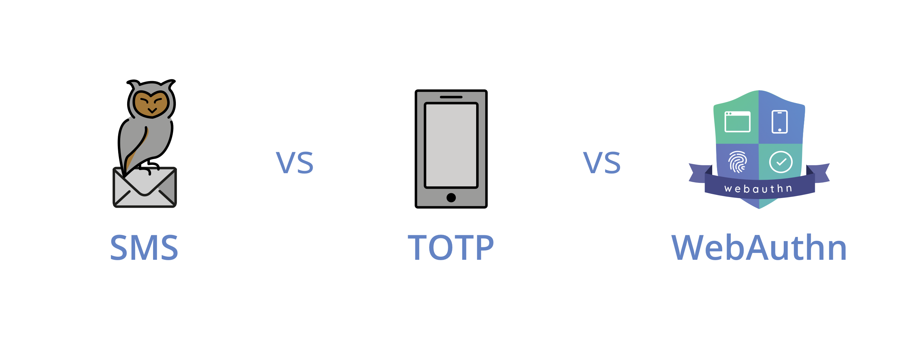
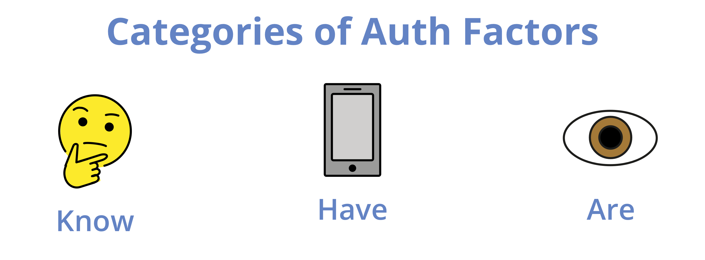

Two Factor or Multi Factor Authentication (2FA / MFA) Schemes are a way to improve the security of applications. Usally these factors are grouped in to the following three groups:

For an authentication scheme to be considered "two factor" the user has to prove their identity by at least two factors of different categories.

For example: Authentication using a *password* and a *fingerprint* is considered two factor as *passwords* are something you know while your *fingerprint* is something you are.

Contrary to that, authentication using *password* and a *security question* is **not** 2FA, as both *password* and *security questions* are something you know.