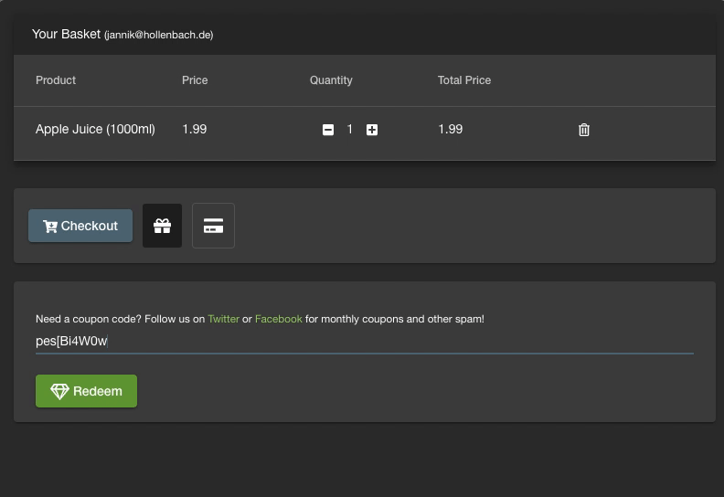

> This post isn't an evaluation or a proper test, it’s just an experiment to see how this could work.

[ModSecurity](https://www.modsecurity.org/) is an open source web application firewall which filters out malicious requests before they can hit the actual application server. The [OWASP Mod Security Core Rule Set (CRS)](https://coreruleset.org/) defines a bunch of predefined rules to be used in ModSecurity. CRS itself provides a bunch of config options, which can be used to tweak its behaviour. The most basic option being the [paranoia level](https://coreruleset.org/faq/#paranoialevel). By increasing the level of paranoia, more and more aggressive rules are activated, which increases the amount of rules applied to figure out whether a request is an attack or not. Unfortunately more rules also means more room for mistakes which will lead to valid requests being wrongly detected as an attack. These cases are generally called [false positive results](https://www.mathsisfun.com/data/probability-false-negatives-positives.html).

In this post I will only use paranoia level 1, which is meant to block a wide set of attacks without interfering with normal requests. I will explore how turn up the level of paranoia in later blog post.

ModSecurity can be integrated in Application in a few ways, I’ll be using the reverse proxy mode in this example, which is really easy to set up using the provided [ModSecurity docker image](https://store.docker.com/community/images/owasp/modsecurity-crs)

## Setup

```yaml
version: '3'
services:
  juiceshop:
    image: bkimminich/juice-shop:v8.0.2
    ports:
      - 3001:3000
  modsecurity:
    image: owasp/modsecurity-crs:v3.1
    ports:
      - 3000:80
    environment:
      - PROXY=1
      # Only supports static ips :(
      - UPSTREAM=192.168.178.42:3001
      - PARANOIA=1
```

One unfortunate detail in this setup is that the ModSecurity container only supports ip addresses as the upstream address for the proxy. This makes the setup more complicated because we cant just use the juiceshop domain name. As a fallback I’ll just forward the internal JuiceShop port and use my local ip and the JuiceShop port as the upstream address for the proxy. In a non test setup we should ensure that no one can connect to port 3001, as this would let attackers bypass the WAF.

## Testing the setup

To test the effectiveness of this setup, we’ll use some of the awesome features of the JuiceShop, namely the end to end (e2e) test suite and the `challenge tracking` feature, which tracks which challenges have been solved, aka. which vulnerabilities were successfully exploited. This will come handy to see which attacks were blocked and which got through.

For comparison I’ve run the test twice, with and without the ModSecurity CRS enabled. After running the test suite i downloaded the list of challenges and took a look which challenges were unsolved in the ModSecurity setup but were solved in the unprotected one. Here’s the List:

- **Forged Review:**

  Post a product review as another user or edit any user's existing review.

- **Five-Star Feedback:**

  Get rid of all 5-star customer feedback.

- **Payback Time:**

  Place an order that makes you rich.

- **Forgotten Developer Backup:**

  Access a developer's forgotten backup file.

- **Product Tampering:**

  Change the `href` of the link within the OWASP SSL Advanced Forensic Tool (O-Saft) product description into `http://kimminich.de`

- **Forged Coupon:**

  Forge a coupon code that gives you a discount of at least 80%.

- **Imaginary Challenge:**

  Solve challenge #99. Unfortunately, this challenge does not exist.

- **NoSQL Injection Tier 2:**

  Update multiple product reviews at the same time.

- **Christmas Special**

  Order the Christmas special offer of 2014.

- **User Credentials**

  Retrieve a list of all user credentials via SQL Injection

For comparisons here’s an overview about which categories of challenges were hindered by ModSecurity:

| Category                   | Default Setup | Setup with ModSecurity |
| -------------------------- | -------- | ---------------- |
| Security through Obscurity | 4        | 4                |
| Sensitive Data Exposure    | 8        | 6                |
| Security Misconfiguration  | 4        | 4                |
| Injection                  | 8        | 5                |
| Broken Authentication      | 8        | 8                |
| Broken Access Control      | 7        | 4                |
| Forgotten Content          | 4        | 4                |
| Roll your own Security     | 6        | 5                |
| Improper Input Validation  | 5        | 4                |
| Vulnerable Components      | 6        | 6                |
| Insecure Deserialization   | 2        | 2                |
| XSS                        | 2        | 2                |
| Race Condition             | 1        | 1                |

## False Positive Rate

Looking at the list of blocked challenges made me quite excited about the amount of attacks ModSecurity was able to block. But on the second look i was quite confused. There were a lot of attacks which simply could not get blocked by a system without any knowledge about the application. To understand what’s is going on here let’s take a look at the forged coupon example. For this challenge you need to forge a coupon to get an 80% discount on an order.

How could a Web Application Firewall know what coupons are valid and which aren’t. And how could they know which discounts would be ok without being able to read the encoded coupons.

Let’s try what happens when you submit a valid coupon:


*Trying to submit a valid coupon, on the ModSecurity protected JuiceShop*

There is a simple explanation, the firewall has been blocking any coupon requests, not just the malicious ones. This is of course a problem as it hinders the normal application usage. For every of these mistakes (false positives) we would have to define an exception to the applied rule.

So to complete the setup we would still have to define exceptions tailored to out application to ensure that it remains usable for our normal customers.

## Conclusion

In this Setup the rate of blocked vulnerabilities was pretty low. Most of the attacks which got blocked got blocked because the complete feature was non functional. But this is still a pretty basic setup running on the minimal paranoia level. For a proper setup we would have to teach ModSecurity details about our application by defining exceptions to the existing rules.

Because of the high level of false positives it kind of hard to say which requests got blocked properly and which were just collateral damage of a too aggressive rule.

In the next post I will try to define these rules to minimise the false positive rate and then we will try to up the level of paranoia. This will hopefully give a better overview about the capabilities of ModSecurity than this simple setup.